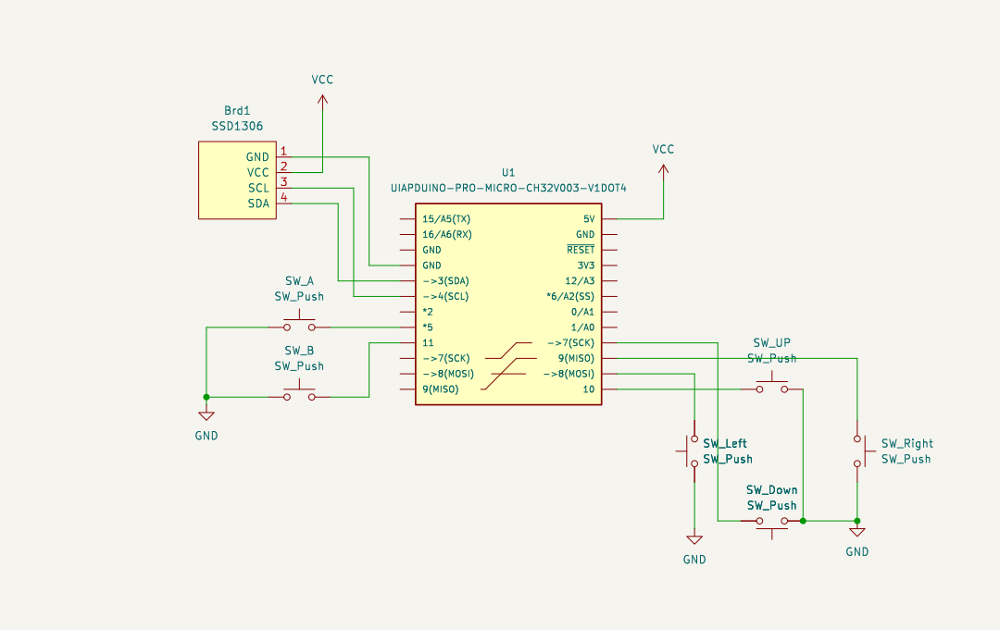
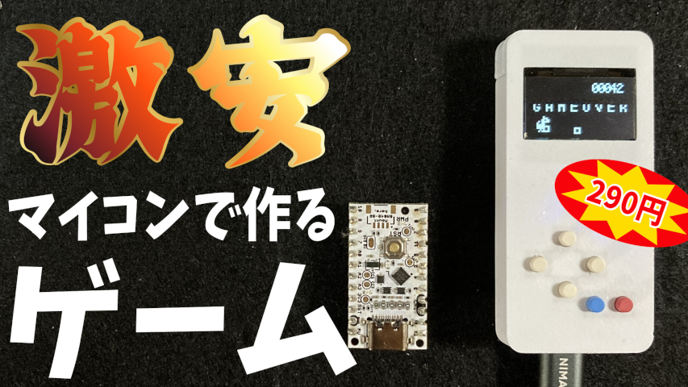

# Micro Game on UIAPduino

## 概要
* 290円で買えるArduino互換ボードUIAPduino を使ってフリスクサイズの携帯ゲームを作るプロジェクトです。
* このプロジェクトではスケッチををArduino環境(IDE) でビルドします。
* このプロジェクトは作業中です

## 準備
Arduino IDE でUIAPduino を使えるようにします。
詳細は[公式のドキュメント](https://www.uiap.jp/uiapduino/pro-micro/ch32v003/v1dot4#getting-started)にありますが、流れとしては以下のようになります。

* ボードマネージャーにUIAPduino用のURL を追加 (File -> Preference)
* ボードマネージャーでUIAPduino用の環境をインストール (Tools -> Board -> Boards Managers)
* 使用するボードをPro Micro CH32V003 に変更 (Tools -> Boards -> UIAPduino -> Pro Micro CH32V003)

## 回路
画像のように配線します。ブレッドボード上でも問題ありません。
必要なパーツは以下の通りです。
* UIAPduino
* SSD1306 (有機ELディスプレイ)
* タクトスイッチ x 6

## ビルド
1. Arduino IDE で'dinosaur/dinosaur.ino' を開きます
1. IDE 左上のverify ボタンをクリック

## アップロード・実行
1. UIAPduino のリセットボタンを長押ししながらPCに接続します
1. IDE 左上のUpload ボタンをクリックします
1. upload後UIAPduino のリセットボタンを押すとゲームが開始されます
1. Upキーでジャンプ、Downキーでしゃがみます。ゲームオーバー時はAボタンで再スタートします。

## 参考資料
* [UIAPduino Pro Micro CH32V003 V1.4 公式](https://www.uiap.jp/uiapduino/pro-micro/ch32v003/v1dot4)

## 動画

